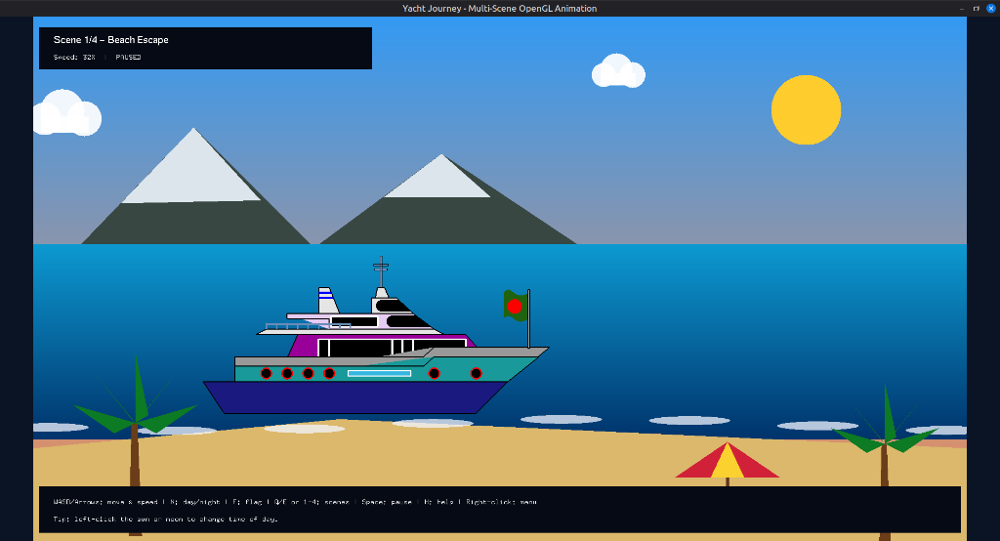
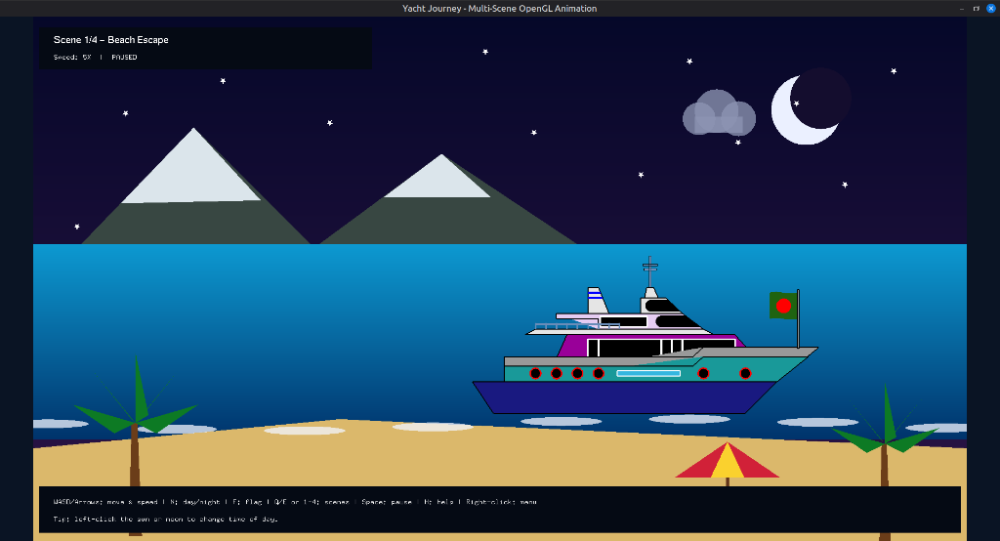
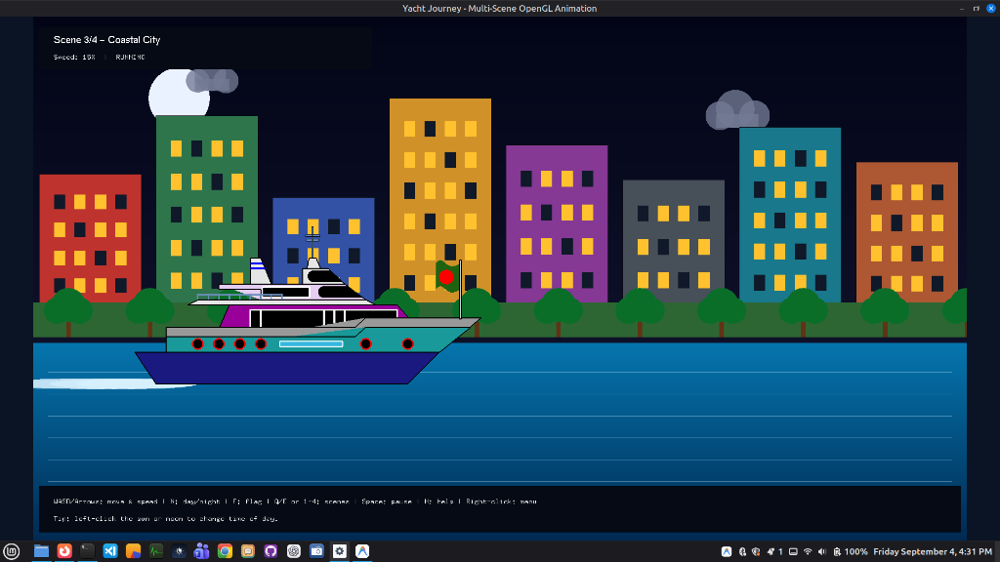
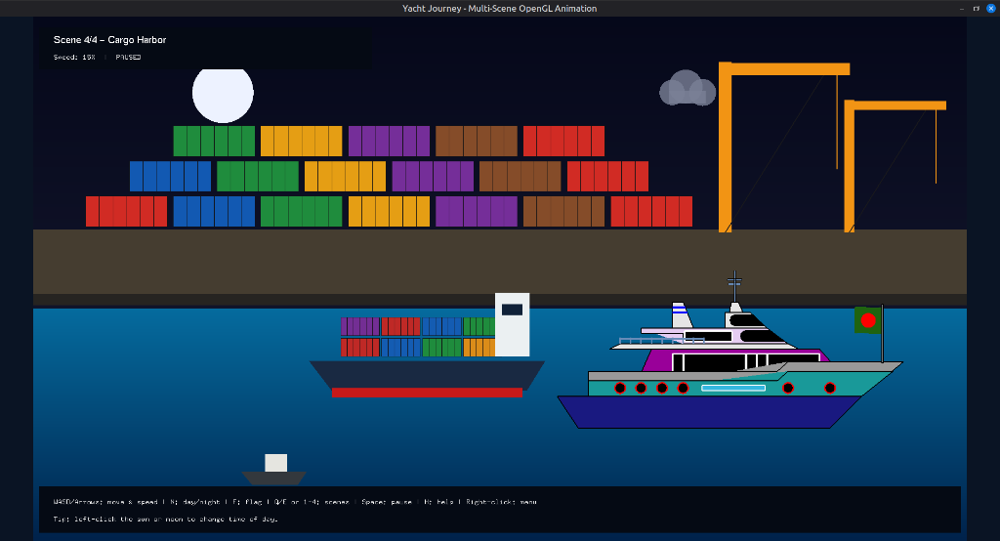

# Yacht Journey — Multi-Scene OpenGL Animation

A portfolio-ready reconstruction of a collaborative university computer graphics project. It keeps **Mehedi Hasan Rafid and his team’s original coordinate-based yacht design** while placing it inside an improved four-scene C++17/OpenGL application.

> **Attribution:** The original course project was collaborative and was hosted at [Shihab-Abesh/Computer-graphics](https://github.com/Shihab-Abesh/Computer-graphics). This repository is maintained by [Mehedi Hasan Rafid](https://github.com/mehedihasanrafid) as a modular, documented portfolio reconstruction. See [`NOTICE.md`](NOTICE.md) and [`docs/CONTRIBUTIONS.md`](docs/CONTRIBUTIONS.md).

### 📸 Application Screenshots

| **Beach Escape (Day)** | **Beach Escape (Night)** |
|:---:|:---:|
|  |  |

| **Coastal City (Night)** | **Cargo Harbor (Night)** |
|:---:|:---:|
|  |  |


## Highlights

- Four animated environments: beach, mountains, coastal city, and cargo harbor
- Original team-designed yacht preserved: hull, multilevel decks, windows, rudder structure, railings, antenna, and colors
- Animated Bangladesh flag generated from cubic Bézier curves
- Automatic and manual scene switching
- Day/night palettes with clickable sun or moon
- Keyboard, special-key, mouse, and right-click menu controls
- Delta-time-based animation with bounded speed
- Consistent double buffering
- Responsive 16:9 viewport with letterboxing and mouse-coordinate conversion
- Modular C++17 architecture
- CMake builds for Linux and Windows
- GitHub Actions build validation
- Portfolio, architecture, report, CV, and attribution documentation

## Demo scenes

| Scene | Main visual elements |
|---|---|
| Beach Escape | Sunset/day-night sky, sea, sand, mountains, palms, umbrella, moving clouds |
| Mountain Passage | Snow-capped mountains, forest shoreline, aircraft, moving clouds |
| Coastal City | Procedural buildings and windows, trees, water, day/night lighting |
| Cargo Harbor | Containers, cranes, cargo ship, moving service boats, dockyard |

## Computer graphics concepts

- Immediate-mode 2D OpenGL rendering
- Quads, polygons, triangles, fans, lines, circles, ellipses, and stars
- Affine translation and scaling
- Hierarchical object composition
- Cubic Bézier interpolation
- Orthographic projection
- Color interpolation and gradient backgrounds
- Event-driven input and GLUT menus
- Timer-driven state updates
- Aspect-ratio-preserving viewport transformation

## Project structure

```text
opengl-yacht-journey/
├── .github/workflows/build.yml
├── assets/
│   ├── preview.svg
│   └── screenshots/
├── docs/
│   ├── ARCHITECTURE.md
│   ├── CONTRIBUTIONS.md
│   ├── CV_ENTRY.md
│   ├── GITHUB_SETUP.md
│   └── PROJECT_REPORT.md
├── include/
│   ├── scenes/
│   ├── App.hpp
│   ├── AppState.hpp
│   ├── Audio.hpp
│   ├── GraphicsPrimitives.hpp
│   ├── Scene.hpp
│   └── Yacht.hpp
├── scripts/
│   ├── build_linux.sh
│   └── build_windows_mingw.ps1
├── src/
│   ├── scenes/
│   ├── App.cpp
│   ├── Audio.cpp
│   ├── GraphicsPrimitives.cpp
│   ├── Scene.cpp
│   ├── Yacht.cpp
│   └── main.cpp
├── CMakeLists.txt
├── CONTRIBUTING.md
├── NOTICE.md
└── README.md
```

## Build on Linux Mint or Ubuntu

Install dependencies:

```bash
sudo apt update
sudo apt install -y build-essential cmake libglut-dev libglu1-mesa-dev
```

Build and run:

```bash
chmod +x scripts/build_linux.sh
./scripts/build_linux.sh
./build/yacht_journey
```

Equivalent manual commands:

```bash
cmake -S . -B build -DCMAKE_BUILD_TYPE=Release
cmake --build build --parallel
./build/yacht_journey
```

## Build on Windows with MinGW

Install:

- CMake
- MinGW-w64
- FreeGLUT development headers and libraries

From PowerShell:

```powershell
powershell -ExecutionPolicy Bypass -File scripts/build_windows_mingw.ps1
.\build\yacht_journey.exe
```

FreeGLUT installation layouts differ. When CMake cannot locate GLUT, provide its include and library paths through your toolchain or CMake cache.

## Controls

| Input | Action |
|---|---|
| `W` / `S` | Move yacht up/down |
| `A` / `D` | Move yacht left/right |
| Arrow Up / Down | Move yacht up/down |
| Arrow Left / Right | Decrease/increase speed |
| `+` / `-` | Increase/decrease speed |
| `N` | Toggle day/night |
| `F` | Start/stop flag animation |
| `Space` | Pause/resume yacht |
| `Q` / `E` | Previous/next scene |
| `1`–`4` | Select a scene directly |
| `R` | Reset yacht position and speed |
| `H` | Show/hide controls |
| `M` | Enable/disable Windows transition sound |
| Left-click sun/moon | Toggle day/night |
| Right-click | Open application menu |
| `Esc` | Exit |

## Original yacht preservation

The yacht renderer in `src/Yacht.cpp` is derived from the original team project rather than from the replacement yacht used in the first reconstruction. The preserved visual components include:

- dark-blue polygonal hull and original outline;
- purple first floor and metallic/cyan deck layers;
- black window strip, circular portholes, and red outlines;
- second and third floors with the original window geometry;
- rudder/control structure and blue decorations;
- railings and antenna platform;
- animated Bangladesh flag using the original cubic Bézier control-point layout.

Only the surrounding application structure, animation timing, input system, resizing, build system, and documentation were modernized.

## Major reconstruction improvements

The portfolio version intentionally addresses structural and behavioral weaknesses commonly found in the original monolithic implementation:

- one callback registration per event type;
- no conflict between move-right and daytime controls;
- consistent `GLUT_DOUBLE` rendering;
- one centralized update loop instead of overlapping animation timers;
- bounded movement speed;
- modular scene and object rendering;
- platform-specific sound isolated from graphics code;
- correct viewport and mouse mapping after resize;
- generated IDE metadata excluded from version control;
- build automation, CI, documentation, and explicit attribution.

## Documentation

- [Original yacht design preservation](docs/ORIGINAL_YACHT_DESIGN.md)
- [Architecture](docs/ARCHITECTURE.md)
- [Project report](docs/PROJECT_REPORT.md)
- [Contributions and attribution](docs/CONTRIBUTIONS.md)
- [CV and portfolio wording](docs/CV_ENTRY.md)
- [GitHub setup and release instructions](docs/GITHUB_SETUP.md)
- [Validation checklist](docs/VALIDATION.md)
- [Changelog](CHANGELOG.md)

## License

No open-source license is currently granted. Add one only after the relevant collaborators agree on reuse and distribution terms.
